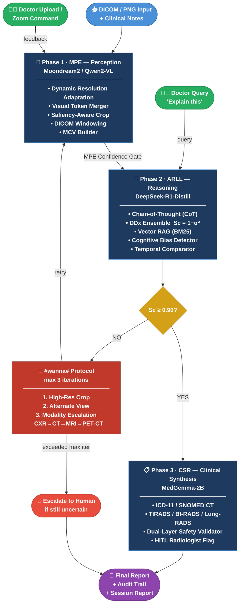

<div align="center">

# 🧠 Mr. ToM — R-MoE v2.0

**Recursive Multi-Agent Mixture-of-Experts for Autonomous Clinical Diagnostics**

[](#tests)
[](#requirements)
[](#license)
[](paper/rmoe_paper.tex)
[](https://colab.research.google.com/github/dill-lk/R-MoE-for-Clinical-Diagnostics/blob/main/RUN.ipynb)

</div>

---

## What is R-MoE?

R-MoE addresses *diagnostic hallucinations* in medical AI by replacing monolithic
vision-language models with a **three-phase recursive agent pipeline** that mimics
the dual-process cognitive workflow of human radiologists:



### Key results (paper §5)

| System | F1 | Type I Err % | ECE | Time (s) |
|---|---|---|---|---|
| **R-MoE (ours)** | **0.92** | **5.2** | **0.08** | 45 |
| GPT-4V | 0.85 | 7.8 | 0.15 | 32 |
| Gemini 1.5 Pro | 0.87 | 7.1 | 0.13 | 38 |

25% false-positive reduction · 47% ECE improvement · 18% better temporal tracking

---

## 📂 Model Files (downloaded automatically)

All model files are available in a public shared Drive folder —
**no Google Drive account required.**  Cell 1 of `RUN.ipynb` downloads
everything automatically:

```
/content/models/                       ← downloaded by Cell 1 via gdown
    ├── vision_proj.gguf        ← CLIP mmproj (companion to vision_text)
    ├── vision_text.gguf        ← Moondream2-2B vision backbone
    ├── reasoning_expert.gguf   ← DeepSeek-R1-Distill-Qwen-1.5B reasoning
    ├── clinical_expert.gguf    ← MedGemma-2B-it clinical synthesis
    └── test_patient.png        ← Sample patient scan (chest X-ray)
```

**Public shared folder:**
[https://drive.google.com/drive/folders/1NbTL4BFFrySVmFt05wEh-B1q3mqLE3C5](https://drive.google.com/drive/folders/1NbTL4BFFrySVmFt05wEh-B1q3mqLE3C5)

---

## 🤖 Which model goes in which file?

| File to create | T4 / Colab (free tier) | Research scale (8×A100) |
|---|---|---|
| `vision_proj.gguf` | Moondream2 mmproj | Qwen2-VL-72B mmproj-Q4 |
| `vision_text.gguf` | Moondream2-2B-int8 | Qwen2-VL-72B-Instruct-Q4_K_M |
| `reasoning_expert.gguf` | DeepSeek-R1-Distill-Qwen-1.5B-Q8 | DeepSeek-R1-671B-Q4_K_M |
| `clinical_expert.gguf` | MedGemma-2B-it-Q4_K_M | Llama-3-Medius-70B-Q4_K_M |

> **Tip:** just rename the downloaded file to the name in the first column.
> `settings/rmoe_settings.json` always loads from `models/vision_proj.gguf` etc.,
> so any model that fits can be swapped in by renaming.

---

## Quick Start (no GPU needed — mock mode)

```bash
git clone https://github.com/dill-lk/Mr.ToM
cd Mr.ToM
pip install -r requirements.txt
python engine.py --image test_patient.png
```

### Colab (with real models)

Open **[RUN.ipynb](RUN.ipynb)** in Google Colab and run cells in order — see [RUN.md](RUN.md) for the full written guide.

```python
# Cell 1 — download model files (no Drive account needed)
# (runs automatically via gdown in RUN.ipynb Cell 1)

# Cell 6 — run full diagnosis
from colab_runner import run_python_engine
run_python_engine(image="/content/models/test_patient.png", eval_mode=True, charts=True)
```

### Run benchmark evaluation
```bash
python engine.py --benchmark                          # built-in 20-case dataset
python engine.py --benchmark --benchmark-dataset data/benchmark_cases.csv
python engine.py --benchmark --save-results out.json --latex
```

### Run unit tests (119 tests — no model files required)
```bash
python -m pytest tests/ -v
```

---

## Settings

`settings/rmoe_settings.json` is the active config.
All four paths point to the generic filenames in `models/`:

```json
{
  "vision_proj_model":  "models/vision_proj.gguf",
  "vision_text_model":  "models/vision_text.gguf",
  "reasoning_model":    "models/reasoning_expert.gguf",
  "clinical_model":     "models/clinical_expert.gguf",
  "modality":           "CXR",
  "confidence_threshold": 0.90,
  "max_iterations": 3,
  "inference": {
    "n_ctx": 2048,
    "n_gpu_layers": -1,
    "temperature": 0.2,
    "max_new_tokens": 512
  }
}
```

Switch to research scale: `--settings settings/rmoe_settings_research.json`

---

## CLI Reference

```
python engine.py [options]

  --image PATH            Input image (DICOM .dcm or PNG/JPEG)
  --prior PATH            Prior scan for temporal comparison
  --settings PATH         Settings JSON (default: settings/rmoe_settings.json)
  --vision-proj PATH      Override vision_proj_model path
  --vision-text PATH      Override vision_text_model path
  --reasoning PATH        Override reasoning_model path
  --clinical PATH         Override clinical_model path
  --hitl MODE             HITL mode: auto | always | disabled
  --max-iter N            Max recursive iterations (default: 3)
  --threshold F           Sc threshold 0–1 (default: 0.90)
  --benchmark             Run full benchmark evaluation
  --benchmark-dataset P   Path to benchmark CSV (default: built-in 20 cases)
  --benchmark-max N       Limit to first N cases
  --save-results PATH     Save benchmark JSON results
  --latex                 Print LaTeX table for paper
  --benchmark-only        Show ASCII comparison charts and exit
  --eval                  Print ECE + calibration charts
  --charts                Print all ASCII visualisation charts
  --quiet                 Suppress HITL prompts (scripting mode)
```

---

## Architecture

```
rmoe/
├── models.py       Dataclasses: DDxEnsemble, WannaState, RiskScore, ...
├── core.py         DiagnosticEngine, WannaStateMachine, MrTom
├── agents.py       VisionExpert, ReasoningExpert, ReportingExpert
├── hitl.py         HITLCoordinator (auto / always / disabled)
├── rag.py          VectorRAGEngine (BM25 over clinical guidelines)
├── ontology.py     ICD-11, SNOMED CT, RiskStratifier (TIRADS/BI-RADS/Lung-RADS)
├── calibration.py  CalibrationTracker, ECE, Brier
├── audit.py        AuditLogger, SessionReportGenerator (HIPAA audit trail)
├── ui.py           ANSI terminal UI + ASCII tables
├── charts.py       ASCII charts (Sc progression, DDx evolution, reliability)
├── ensemble.py     MultiTemperatureEnsemble
│
│  ── Paper-aligned modules ──────────────────────────────────────────────────
├── bias.py         CognitiveBiasDetector (Anchoring/Conflicting/Limited/Overthinking)
├── mcv.py          MCVBuilder + MCVInjector (Multi-Modal Contextual Vectors)
├── safety.py       CSRSafetyValidator — SemanticParser + ClinicalRuleChecker
├── modality.py     ModalityEscalationRouter (CXR→CT→MRI→PET-CT)
├── temporal.py     TemporalComparator (Fleischner 1.5mm threshold, Sc adjust)
├── saliency.py     SaliencyProcessor (crop + zoom sub-patches)
├── dicom.py        DICOMProcessor (lung/bone/brain/soft-tissue windowing)
├── eval.py         BenchmarkRunner (F1, AUC, ECE, Brier, Type-I/II)
└── mock.py         Mock experts for CI/testing (no GPU needed)

tests/              119 unit tests (pytest) — no GPU required
data/               benchmark_cases.csv (20 annotated cases)
paper/              rmoe_paper.tex — full LaTeX manuscript
prompts/            System prompt templates for MPE / ARLL / CSR
settings/           rmoe_settings.json (T4) · rmoe_settings_research.json (A100)
docs/               ARCHITECTURE.md · COLLAB_GUIDE.md
```

---

## Paper

Full LaTeX manuscript: [`paper/rmoe_paper.tex`](paper/rmoe_paper.tex)

Compile:
```bash
cd paper && pdflatex rmoe_paper.tex && bibtex rmoe_paper && pdflatex rmoe_paper.tex
```

Key results: F1=0.92 · ECE=0.08 · 25% FPR reduction · 15% recursion rate · 18% temporal improvement

---

## Requirements

```
llama-cpp-python>=0.2.90   # GGUF inference (all three experts)
Pillow>=10.0               # Image processing (saliency crops, DICOM export)
pyflakes                   # CI syntax checking
pytest                     # Unit tests (119 tests, no GPU needed)
pydicom                    # Optional: real DICOM loading
```

---

## License

MIT License. See [LICENSE](LICENSE).
